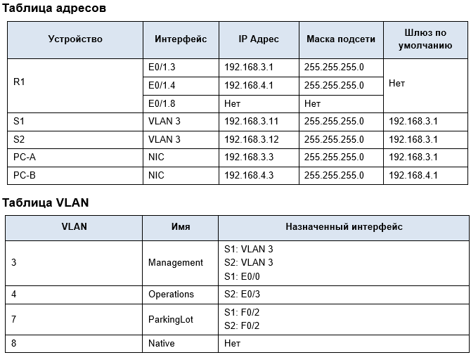

# Лабораторная работа №1
## Настройка "Роутер на палочке", маршрутизация между виланами.

## Цели работы:

  1. Построить сеть и настроить базовую конфигурацию устройств.
  2. Создать VLAN`ы и назначить порты на коммутаторе.
  3. Настроить соединение 802.1Q Trunk между коммутаторами.
  4. Настроить маршрутизацию между VLAN на маршрутизаторе.
  5. Проверить, что маршрутизация между VLAN работает

