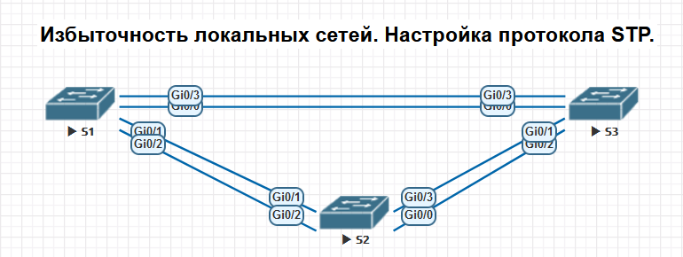
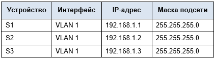

# Лабораторная работа №2
## Избыточность локальных сетей. Настройка протокола STP.
####

### Таблица адресации

### Цели работы:
Часть 1. Создание сети и настройка основных параметров устройства;  
Часть 2. Выбор корневого моста;  
Часть 3. Наблюдение за процессом выбора протоколом STP порта, исходя из стоимости портов;  
Часть 4. Наблюдение за процессом выбора протоколом STP порта, исходя из приоритета портов;  
