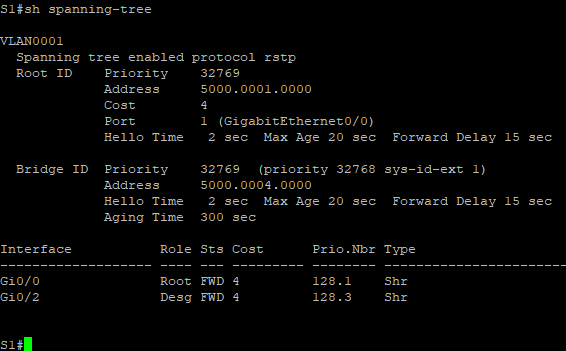
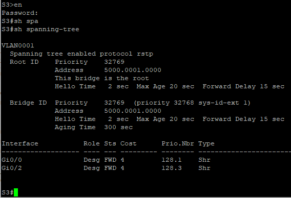
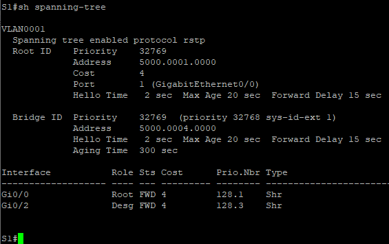
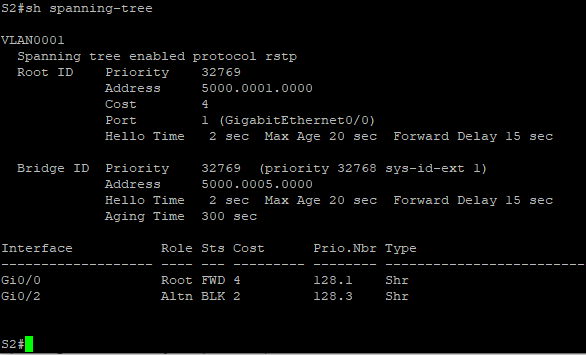
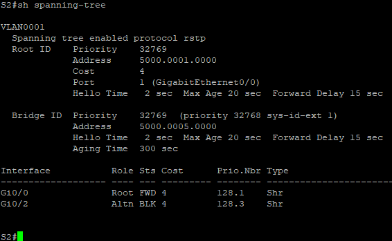
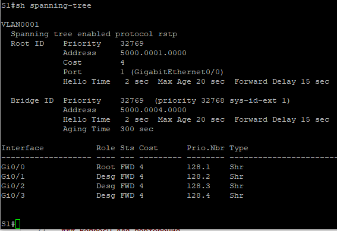
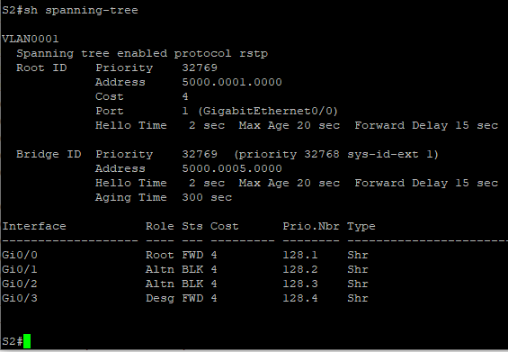

# Лабораторная работа №2
## Избыточность локальных сетей. Настройка протокола STP.
####

### Таблица адресации

### Цели работы:
Часть 1. Создание сети и настройка основных параметров устройства;  
Часть 2. Выбор корневого моста;  
Часть 3. Наблюдение за процессом выбора протоколом STP порта, исходя из стоимости портов;  
Часть 4. Наблюдение за процессом выбора протоколом STP порта, исходя из приоритета портов;  

### Выполнение работы:
### Часть 1:  Создание сети и настройка основных параметров устройства

Шаг 1:  Создана сеть согласно топологии, подключены линки.   
Шаг 2:  Выполнена инициализация и презагрузка коммутаторов.   
Шаг 3:  Настроены базовые параметры коммутаторов.   
Шаг 4:  Выполнена проверка связи между коммутаторами:  
    Успешно ли выполняется эхо-запрос от коммутатора S1 на коммутатор S2?   ___ _Да____   
    Успешно ли выполняется эхо-запрос от коммутатора S1 на коммутатор S3?   ___ _Да____   
    Успешно ли выполняется эхо-запрос от коммутатора S2 на коммутатор S3?   ___ _Да____  

### Часть 2: Определение корневого моста
Шаг 1: Все порты на коммутаторах отключены.   
Шаг 2: Все подключенные порты настроены в качестве транковых.  
Шаг 3: На всех коммутаторах включены порты __Gi0/2__ (F0/2) и __Gi0/0__ (F0/4).   
Шаг 4: Отображен результат ввода команды __show spanning-tree__.

   
  
  

С учетом выходных данных отвечаем на следующие вопросы:   
Какой коммутатор является корневым мостом? _______ __Коммутатор S3__ __   
Почему этот коммутатор был выбран протоколом spanning-tree в качестве корневого моста? __ __При прочих равных условиях этот коммутатор имеет наименьший mac-адрес: 5000.0001.000__ __.   
Какие порты на коммутаторе являются корневыми портами? ___ __Коммутатор S1 порт Gi0/0, коммутатор S2 Gi0/0, коммутатор S3 корневых портов нет__ ___________________   
Какие порты на коммутаторе являются назначенными портами?  ___ __Коммутатор S1 порт Gi0/2, коммутатор S2 назначенных портов нет, коммутатор S3 порт Gi0/0 и порт Gi0/2__ ____________________   
Какой порт отображается в качестве альтернативного и в настоящее время заблокирован? __ __Коммутатор S2 порт Gi0/2__ ____   
Почему протокол spanning-tree выбрал этот порт в качестве невыделенного (заблокированного) порта?  __ __Выбор на каком коммутатоторе заблокировать порт происходит на основе стоимости пути__ _____   
### Часть 3: Наблюдение за процессом выбора протоколом STP порта, исходя из стоимости портов
Шаг 1: Определить коммутатор с заблокированным портом __ __Коммутатор S2, порт Gi0/2__ __
Шаг 2: Изменить стоимость порта:

S2(config)# interface Gi0/2   
S2(config-if)# spanning-tree cost 2   

Шаг 3:Просмотреть изменения протокола spanning-tree.   

 

Шаг 4:	Удалить изменения стоимости порта.   
S2(config)# interface Gi0/2   
S2(config-if)#no spanning-tree cost 2  

### Часть 4: Наблюдение за процессом выбора протоколом STP порта, исходя из приоритета портов
a. Включить порты Gi0/1 и Gi0/3 на всех коммутаторах.  
  S1,2,3(config)# interface range Gi0/1-3   
  S1,2,3(config-if)# no shut

b. Ждать 30 секунд, чтобы протокол STP завершил процесс перевода порта, затем выполнить команду show spanning-tree на коммутаторах некорневого моста.   

 
  

Какой порт выбран протоколом STP в качестве порта корневого моста на каждом коммутаторе некорневого моста? __ __Коммутатор S1 выбран порт Gi0/0, коммутатор S2 выбран порт Gi0/0__ ___    
Почему протокол STP выбрал эти порты в качестве портов корневого моста на этих коммутаторах? __ __Выбор произошел по наименьшему номеру порта__ ___  

### Вопросы для повторения

1.	Какое значение протокол STP использует первым после выбора корневого моста, чтобы определить выбор порта?  ____ 
2.	Если первое значение на двух портах одинаково, какое следующее значение будет использовать протокол STP при выборе порта? ____  
3.	Если оба значения на двух портах равны, каким будет следующее значение, которое использует протокол STP при выборе порта? ______  

