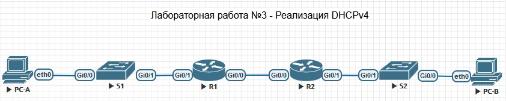
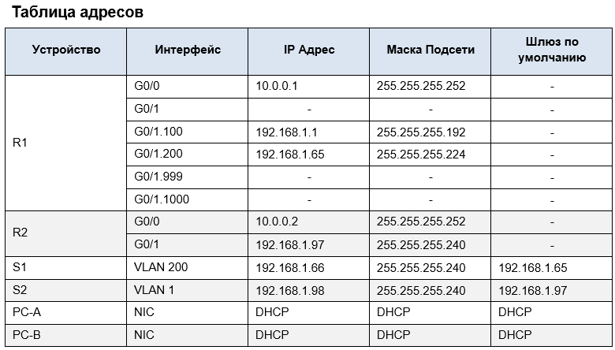
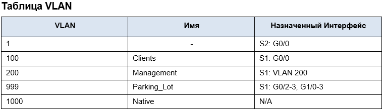

# Лабораторная работа №3

## Реализация протокола DHCPv4

## `Цели работы:`

### [Часть 1: Построить схему сети и произвести базовую конфигурацию устройств](#часть-1-построение-сети-и-базовая-конфигурация-устройств)

### [Часть 2: Сконфигурировать и проверить два DHCPv4 Сервера на маршрутизаторе R1](#часть-2-настройка-и-проверка-работоспособности-двух-dhcpv4-серверов-на-маршрутизаторе-r1)

### [Часть 3: Сконфигурировать и проверить DHCP ретрансляцию на маршрутизаторе R2](#часть-3-настройка-и-проверка-работоспособности-dhcp-ретрансляции-на-маршрутизаторе-r2)

### Часть 1: Построение сети и базовая конфигурация устройств

#### Шаг 1: Схема адресации

Разбить сеть __192.168.1.0 /24__ на подсети на следующих условиях:  

а)  “Подсеть A”, количество хостов 58 (Клиентский VLAN на R1).  
Подсеть A: __192.168.1.0 /26__  
IP адрес в Таблице Адресов для R1 G0/1.100 - __192.168.1.1__

б)   “Подсеть Б”, количество хостов 28 (VLAN управления на R1).  
Подсеть Б: __192.168.1.64 /27__  
IP адрес в Таблице Адресов для R1 G0/1.200 - __192.168.1.65__

б)   “Подсеть В”, количество хостов 12 (VLAN клиентов на R2).  
Подсеть В: __192.168.1.96 /28__  
IP адрес в Таблице Адресов для R2 G0/1 - __192.168.1.97__  

#### Шаг 2: Организация топологии сети, подключение портов  

Подключаем порты на устройствах согласно схеме сети.

#### Шаг 3: Базовая настройка маршрутизаторов  

Производим базовую настройку маршрутизаторов. См. файлы конфигурации [R1](/Labs/Lab3/R1_Config.txt) и [R2](/Labs/Lab3/R2_Config.txt).

#### Шаг 4: Настраиваем маршрутизацию между VLAN`ми на R1
  
а) Активируем интерфейс G0/1;  
б) Настраиваем подинтерфейсы для каждой VLAN согласно таблице;  
в) Убеждаемся что подинтерфейсы активны;

#### Шаг 5: Настраиваем интерфейс G0/1 на R2, затем интерфейс G0/0 и статическую маршрутизацию для обоих маршрутизаторов

#### Шаг 6: Базовая конфигурация коммутаторов S1 и S2

Производим базовую настройку коммутаторов. См. файлы конфигурации [S1](/Labs/Lab3/S1_Config.txt) и [S2](/Labs/Lab3/S2_Config.txt).

#### Шаг 7: Создание VLAN`ов на коммутаторе S1

#### Шаг 8: Назначение VLAN`ов на интерфейсы коммутатора

#### Шаг 9: Ручная настройка порта G0/1 коммутатора S1 в режиме 802.1Q trunk

### Часть 2: Настройка и проверка работоспособности двух DHCPv4 серверов на маршрутизаторе R1

### Часть 3: Настройка и проверка работоспособности DHCP ретрансляции на маршрутизаторе R2

