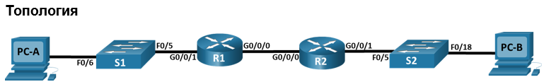
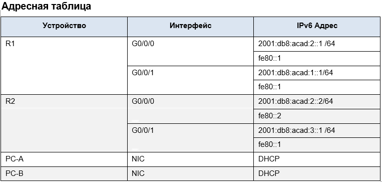

# [<u>Лабораторная работа №3</u>](/README.md)

## [Реализация протокола DHCPv4](#реализация-dhcpv4)

## [Настройка протокола DHCPv6](#настройка-dhcpv6)

***

## Реализация DHCPv4

## `Цели работы:`

### [Часть 1: Построить схему сети и произвести базовую конфигурацию устройств](#часть-1-построение-сети-и-базовая-конфигурация-устройств)

### [Часть 2: Сконфигурировать и проверить два DHCPv4 Сервера на маршрутизаторе R1](#часть-2-настройка-и-проверка-работоспособности-двух-dhcpv4-серверов-на-маршрутизаторе-r1)

### [Часть 3: Сконфигурировать и проверить DHCP ретрансляцию на маршрутизаторе R2](#часть-3-настройка-и-проверка-работоспособности-dhcp-ретрансляции-на-маршрутизаторе-r2)

***

### Часть 1: Построение сети и базовая конфигурация устройств

#### __Шаг 1: Схема адресации__

Разбить сеть __192.168.1.0 /24__ на подсети на следующих условиях:  

- “Подсеть A”, количество хостов 58 (Клиентский VLAN на R1).  
Подсеть A: __192.168.1.0 /26__  
IP адрес в Таблице Адресов для R1 G0/1.100 - __192.168.1.1__

- “Подсеть B”, количество хостов 28 (VLAN управления на R1).  
Подсеть B: __192.168.1.64 /27__  
IP адрес в Таблице Адресов для R1 G0/1.200 - __192.168.1.65__

- “Подсеть C”, количество хостов 12 (VLAN клиентов на R2).  
Подсеть C: __192.168.1.96 /28__  
IP адрес в Таблице Адресов для R2 G0/1 - __192.168.1.97__  

#### Шаг 2: Организация топологии сети, подключение портов  

- Подключаем порты на устройствах согласно схеме сети.

#### Шаг 3: Базовая настройка маршрутизаторов  

- Производим базовую настройку маршрутизаторов. См. файлы конфигурации [R1](/Labs/Lab3/R1_Config.txt) и [R2](/Labs/Lab3/R2_Config.txt).

#### Шаг 4: Настраиваем маршрутизацию между VLAN`ми на R1
  
- Активируем интерфейс G0/1;  
- Настраиваем подинтерфейсы для каждой VLAN согласно таблице адресов;  
- Убеждаемся что подинтерфейсы активны;

#### Шаг 5: Настраиваем интерфейс G0/1 на R2, затем интерфейс G0/0 и статическую маршрутизацию для обоих маршрутизаторов

#### Шаг 6: Базовая конфигурация коммутаторов S1 и S2

- Производим базовую настройку коммутаторов. См. файлы конфигурации [S1](/Labs/Lab3/S1_Config.txt) и [S2](/Labs/Lab3/S2_Config.txt).

#### Шаг 7: Создание VLAN`ов на коммутаторе S1

- Коммутатор S2 имеет только базовые настройки.  
- На коммутаторе S1 создаем VLAN`ы и присваиваем им имена согласно таблице VLAN.
- Настроить и активировать интерфейс управления на S1 (Vlan 200) используя второй IP-адрес из подсети расчитанной ранее. Установить шлюз по умолчанию для S1.
- Настроить и активировать интерфейс управления на S2 (Vlan 1) используя второй IP-адрес из подсети расчитанной ранее. Установить шлюз по умолчанию для S2.
- Назначить всем не используемым портам на коммутаторе S1 VLAN Parking_Lot перевести их в режим доступа и административно заблокировать их.
- На коммутаторе S2 административно заблокировать все не используемые порты.

#### Шаг 8: Назначение VLAN`ов на интерфейсы коммутатора

- В соответствии с таблицей VLAN назначаем портам VLAN`ы и настроить их в режим доступа.
- Убедиться в правильности настроек.
#### Интрерфейс G0/1 находится в VLAN`е по умолчанию VLAN1

#### Шаг 9: Ручная настройка порта G0/1 коммутатора S1 в режиме 802.1Q trunk

- Принудительно переводим интерфейс в режим trunk
- Назначаем VLAN 1000 в качестве нативного
- Добавляем VLAN`ы 100, 200, 1000 к разрешенным для пересылки через trunk
- Сохраняем конфигурацию
- Проверяем статус trunk порта  
#### На этом этапе компьютеры получают адреса из 169.254.x.y подсети по автонастройке (Automatic Private IP Addressing).

***

### Часть 2: Настройка и проверка работоспособности двух DHCPv4 серверов на маршрутизаторе R1

Настраиваем DHCPv4 сервер на маршрутизаторе R1. Сервер обслуживает 2-а пула адресов из подсетей А и С

#### Шаг 1:

***

### Часть 3: Настройка и проверка работоспособности DHCP ретрансляции на маршрутизаторе R2

***
## Настройка DHCPv6

## `Цели работы:`

### Часть 1: Построить схему сети и произвести базовую конфигурацию устройств

### Часть 2: Определить получение SLAAC адресов с маршрутизатора R1

### Часть 3: Настроить Stateless DHCPv6 сервер на маршрутизаторе R1

### Часть 4: Настроить Stateful DHCPv6 сервер на маршрутизаторе R1

### Часть 5: Настроить DHCPv6 Relay на маршрутизаторе R2

### `Инструкции:`

### Часть 1: Построить схему сети и произвести базовую конфигурацию устройств

#### Шаг 1:

#### Шаг 2:

#### Шаг 3:

#### Шаг 4:

### Часть 2: Определить получение SLAAC адресов с маршрутизатора R1