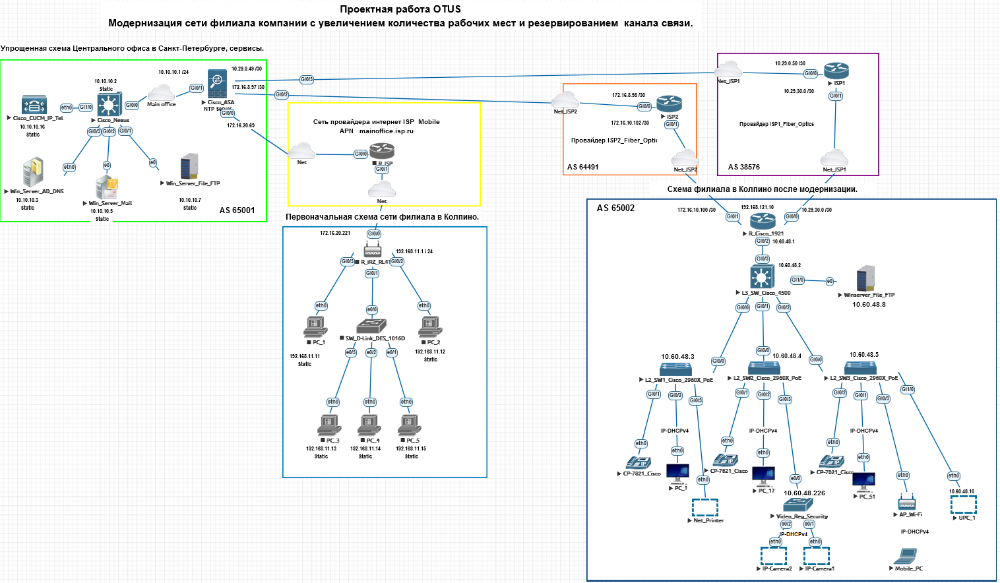
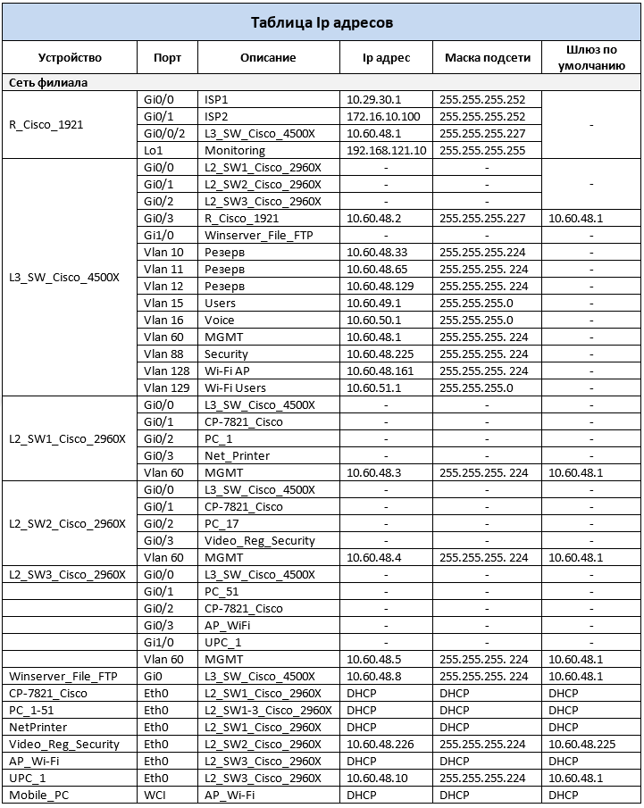
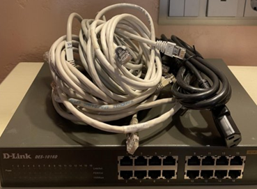
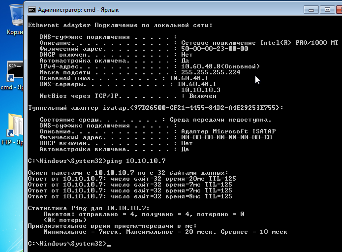

# <u>Проектная работа</u>

## Тема: "Модернизация сети филиала компании с увеличением количества рабочих мест и резервным каналом связи".

## Легенда: 
Компания <b>%Company Name%</b> расширяется и нанимает больше сотрудников.  
Новые рабочие места планируется размещать на одном из филиалов, где уже есть канал связи от интернет провайдера, небольшая сеть с 1 vlan, статическая ip- адресация на несколько рабочих мест и пустующие помещения.  
В рамках модернизации ЛВС планируется: прокладка новой кабельной сети, замена сетевого оборудования, расширение адресного пространства, внедрение нескольких vlan, подключение 2-го интернет канала.  
В последствии планируется проведение интернет телеконференций для руководителей рабочих групп, внедрение ip-телефонии, системы контроля и управления доступом.

## Цели проекта
Применить на практике изученные технологии  

## Что планировалось

## Используемые технологии

## Что получилось

## Схемы/архитектура

## Выводы

