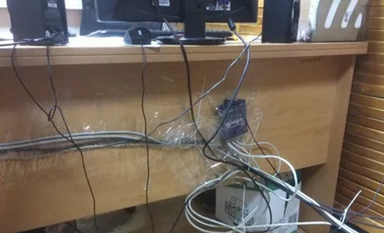
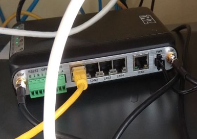

# Проектная работа
## Тема: Модернизация сети филиала компании с увеличением количества рабочих мест и резервным каналом связи

### Легенда
Компания <b>Company-Name.ru</b> расширяется и нанимает больше сотрудников.  
Новые рабочие места планируется размещать на одном из филиалов в Колпино, где уже есть канал связи от интернет провайдера, небольшая сеть с 1 vlan, статическая ip- адресация на несколько рабочих мест и пустующие помещения.   
В рамках модернизации ЛВС планируется:  
прокладка новой кабельной сети,  
замена сетевого оборудования,  
расширение адресного пространства,  
внедрение нескольких vlan,  
подключение 2-го интернет канала.  
В последствии планируется 
проведение интернет телеконференций для руководителей рабочих групп, 
внедрение ip-телефонии,  
системы контроля и управления доступом. 

## Цели проекта

1. Реорганизовать существующую сеть филиала в расчете на увеличение количества рабочихмест и новыесервисы.
2. Организовать помещение коммутационной (серверной).
3. Внедрить новые сервисы.
4. Повысить безопасность.  

## Что планировалось

1. Реорганизовать существующую «плоскую» сеть филиала на несколькопользователей.  Организовать сеть с иерархической структурой на 50 подключений с возможностью дальнейшего масштабирования.  
2. Заменить канал связи Mobile GSM 3G на оптоволоконный канал связи и добавить резервный канал.   Заменить коммутационное оборудование.
3. Организовать коммутационное (серверное) помещение с ограниченным доступом.  
4. Проложить новые кабельные линии (СКС).
5. Внедрить новые сервисы,повысить безопасность.

## Используемые технологии

1. VLAN,BGP,PoE,GigabitEthernet,DHCP,IPv4,Voice,NTP,STP,FTP,Wi-Fi.  
2. В перспективе видеоконференцсвязь, сетеваяпечать, балансировка канала связи.  
3. Вдальнейшем внедрение облачного видеонаблюдения, систем мониторинга и управления СКУД, Охранной и Пожарной сигнализацией.

## Что было

Сетевая инфраструктура:
1. Роутер iRZ RL41 4 Lan +1 Wan порт c 2-я антеннами 3G GSM и sim картой с 20Гб лимитом трафика;

2. Неуправляемый коммутатор D-Link DES 1016D на 16 портов Lan;

3. Сеть проложенная “хозспособом” в разное время из нескольких типов витой пары cat. 5, 5e, 6;

4. Оборудование подключенное без сетевых фильтров и через тройники;

5. Отсутствует документация.

 
 

## Что получилось

Сетевая инфраструктура:

1. Маршрутизатор Cisco 1921/k9 с модулями расширения и SFP модулем под оптику - 1шт.

2. Высокопроизводительный управляемый коммутатор Cisco WS-C4500x-16SFP+  - 1шт.

3. Управляемые коммутаторы Cisco Catalyst 2960-X на 24 порта Lan и 4 SFP -      3 шт.

3. СКС витая пара cat. 5e, каждый провод, порт на патч-панели и розетка промаркированы и задокументированы.

4. Оборудование размещено в помещении с кондиционерами оснащенных блоком ротации.

5. Оборудование подключено через источник бесперебойного питания.

## Схемы/архитектура

## Выводы

